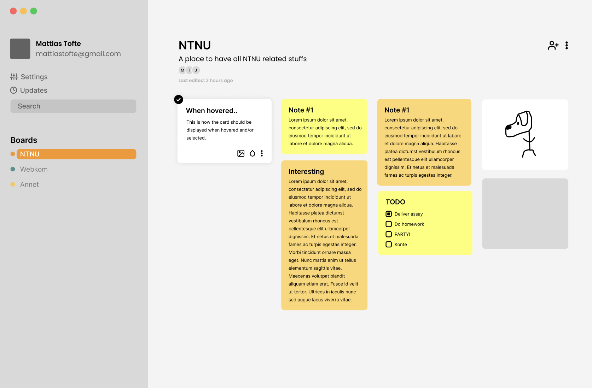

# Dokumentasjon for innlevering 1

Innlevering 1 implementerer en enkel app for å opprette og lagre notes. I appen kan brukeren opprette en eller flere oppslagstavler som man kan gi et navn og en kort forklaring til. På hver oppslagstavle kan man kan man opprette notater og som man kan gi både tittel og tekst. 

## Brukerhistorie

Brukerhistorier for innlevering 1 [ligger her](docs/release1/userStories.md). 

For en student er det nyttig å enkelt kunne se notatene man har skrevet og at de er sortert etter fagemne. Derfor er det nyttig at alle fagemnene(oppslagstavlene) er synlig i en liste og notatene som tilhører hvert fagemne blir synlig dersom man trykker på det. For studenten er det også nyttig å kunne redigere notatene sine, noe man kan gjøre ved å trykke på tekstfeltet og skrive inn det man ønsker. Hvis studenten ikke trenger notatet lenger kan man enkelt slette notatet.

## Designskisse
Før vi begynte å implementere brukergrensesnitt lagde vi en skisse av UI/UX i figma. Skissen inkluderer en sidebar for enkel navigasjon mellom boards samtidig som den gir oversikt over brukerinfo. All funksjonalitet har ikke blitt implementert enda, men dette er hvordan vi kan se for oss appen i fremtidige iterasjoner.
